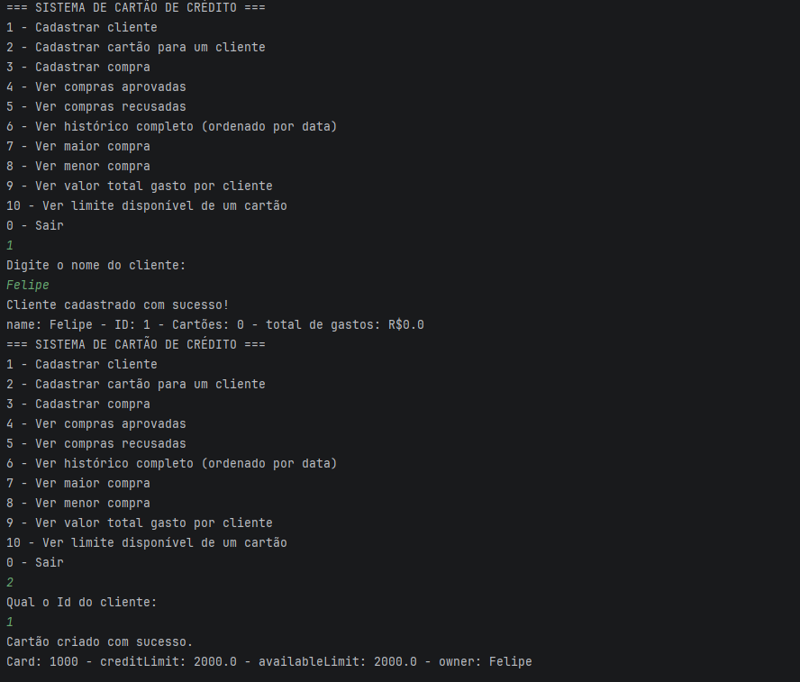

# Gerenciador de Cartão de Crédito

## 📌 Sobre o projeto

Este projeto simula um sistema de gerenciamento de cartão de crédito utilizando Java.

O objetivo é representar o funcionamento básico de um banco, aplicando conceitos de Programação Orientada a Objetos como encapsulamento, composição de objetos e separação de responsabilidades entre camadas.

## 🚀 Funcionalidades

- Cadastro de clientes.
- Cadastro de cartões de crédito para um cliente.
- Registro de compras, com aprovação ou recusa automática de acordo com o limite disponível.
- Suporte a parcelamento das compras.
- Consulta de compras aprovadas e recusadas.
- Consulta do histórico completo de compras, ordenado por data.
- Consulta da maior e da menor compra de um cartão.
- Consulta do valor total gasto por um cliente.
- Consulta do limite disponível de um cartão.

## 🛠️ Tecnologias utilizadas

- Java
- Git
- GitHub

## 📚 Conceitos aplicados

- Programação Orientada a Objetos
- Encapsulamento
- Comparable e Comparator
- Enum
- Separação de responsabilidades entre camadas (model e service)

## ▶️ Como executar

1. Clone este repositório.
2. Abra o projeto em uma IDE Java (como IntelliJ IDEA ou Eclipse).
3. Execute a classe `Main`.
4. Utilize o menu do sistema para interagir com o gerenciador de cartão de crédito.

## 📷 Demonstração

## 👨‍💻 Autor

Desenvolvido por **Felipe Fernando**.

🔗 GitHub: https://github.com/felipebss0593
